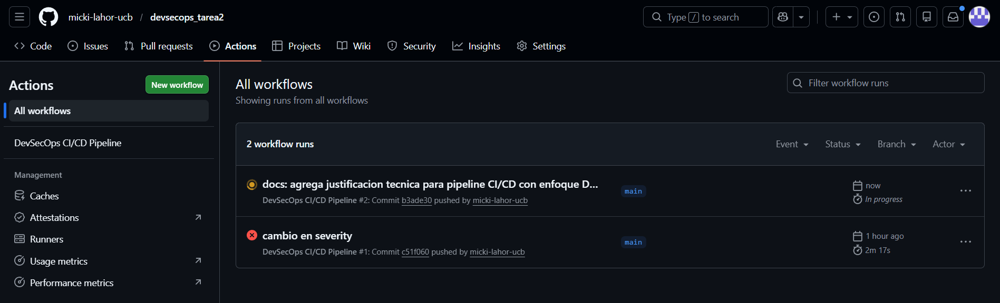
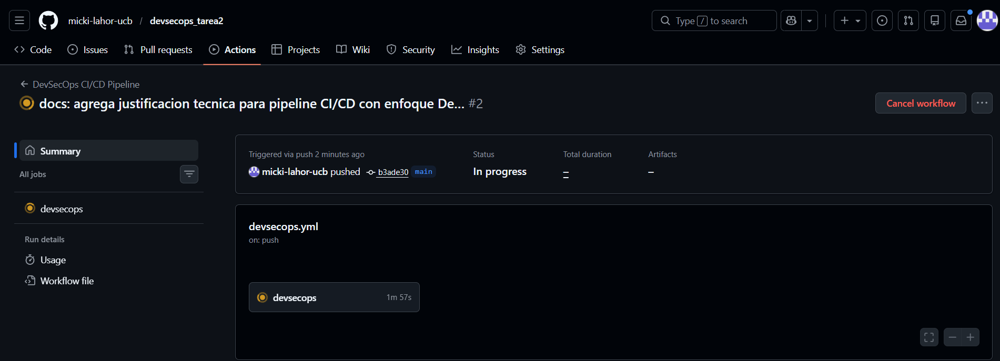
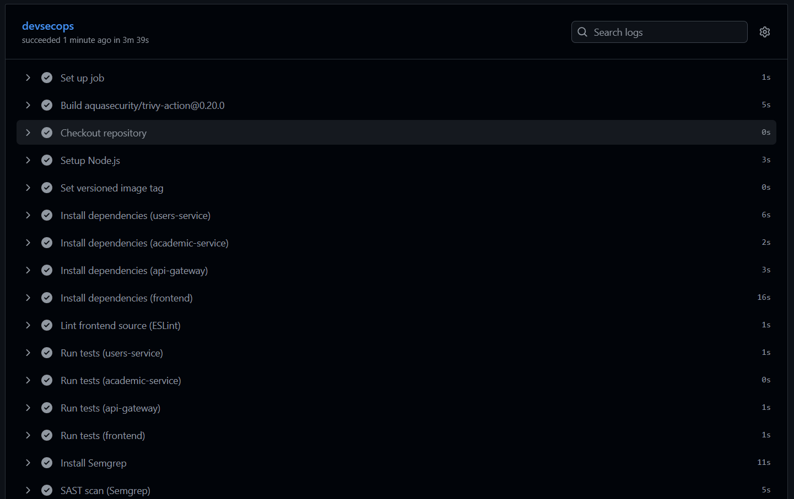
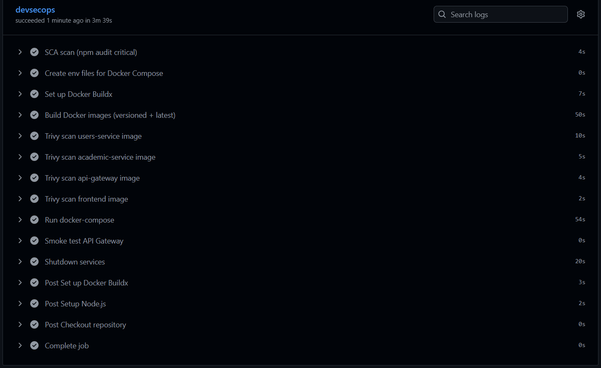
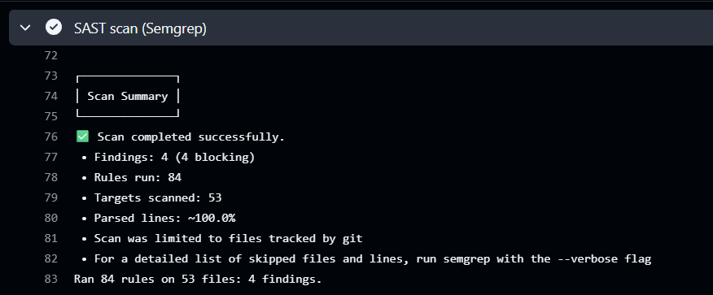
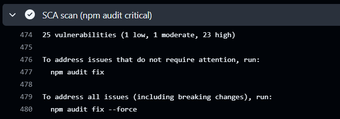
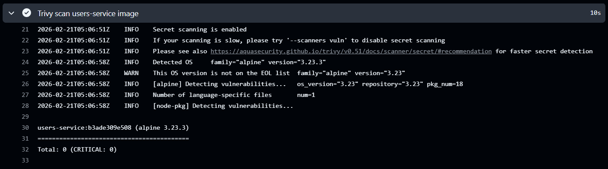
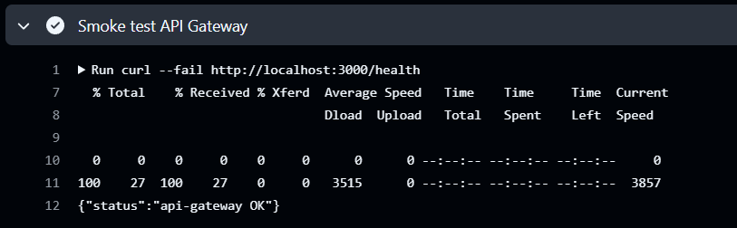
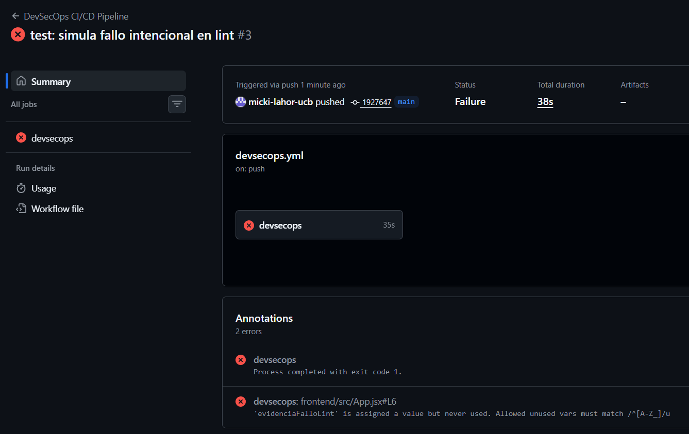

# Evidencias de ejecucion del pipeline CI/CD DevSecOps

## 1. Objetivo de esta seccion
Este documento presenta la evidencia de ejecucion del pipeline CI/CD con enfoque DevSecOps, en cumplimiento del punto 4 de la consigna.  
El objetivo es demostrar, de forma trazable, que las etapas de calidad, seguridad y validacion operativa se ejecutaron correctamente en GitHub Actions.

---

## 2. Datos de ejecucion verificados
- **Repositorio:** `micki-lahor-ucb/devsecops_tarea2`
- **Workflow:** `DevSecOps CI/CD Pipeline`
- **Branch:** `main`
- **Commit asociado:** `b3ade30`
- **Evento disparador:** `push`
- **Estado del run:** `Success`
- **Duracion total del run:** `3m 43s` (aprox.)
- **Estado del job `devsecops`:** `succeeded`
- **Duracion del job `devsecops`:** `3m 39s` (aprox.)

**Enlaces de evidencia:**
- Run: [https://github.com/micki-lahor-ucb/devsecops_tarea2/actions/runs/22250824100](https://github.com/micki-lahor-ucb/devsecops_tarea2/actions/runs/22250824100)
- Job: [https://github.com/micki-lahor-ucb/devsecops_tarea2/actions/runs/22250824100/job/64374024437](https://github.com/micki-lahor-ucb/devsecops_tarea2/actions/runs/22250824100/job/64374024437)
- Run fallido intencional (gate de calidad): [https://github.com/micki-lahor-ucb/devsecops_tarea2/actions/runs/22251558178](https://github.com/micki-lahor-ucb/devsecops_tarea2/actions/runs/22251558178)

---

## 3. Validacion de etapas del pipeline
Durante la ejecucion se verificaron de manera automatica las siguientes etapas:

1. Instalacion reproducible de dependencias (`npm ci`).
2. Analisis de calidad de codigo (`ESLint`).
3. Testing automatico por componente.
4. Analisis estatico de seguridad (`Semgrep` - SAST).
5. Analisis de vulnerabilidades en dependencias (`npm audit` - SCA).
6. Construccion de imagenes Docker versionadas.
7. Escaneo de seguridad de imagenes (`Trivy`).
8. Smoke test post-despliegue sobre `api-gateway`.

El resultado exitoso confirma que, para el commit evaluado, el pipeline cumplio las compuertas funcionales y de seguridad definidas.

---

## 4. Capturas de pantalla

### 4.1 Captura del resumen general del run
- **Imagen:**

### 4.2 Captura del job `devsecops`
- **Imagen:**

### 4.3 Captura de logs de seguridad (SAST/SCA)
- **Imagen:**

### 4.4 Captura de logs de seguridad de contenedores
- **Imagen:**

### 4.5 Captura del smoke test
- **Imagen:**

### 4.6 Captura de ejecucion fallida intencional (control de calidad)
- **Descripcion:** Se forzo un fallo de `lint` para comprobar que el pipeline bloquea cambios que incumplen reglas de calidad.
- **Run asociado:** [https://github.com/micki-lahor-ucb/devsecops_tarea2/actions/runs/22251558178](https://github.com/micki-lahor-ucb/devsecops_tarea2/actions/runs/22251558178)
- **Motivo del fallo:** variable no utilizada en `frontend/src/App.jsx` (`no-unused-vars`).
- **Imagen:**

---

## 5. Conclusion de verificacion
Con base en los runs referenciados, se evidencia tanto una ejecucion exitosa como una ejecucion fallida intencionalmente, lo cual valida el funcionamiento de los gates del pipeline.  
En consecuencia, se verifica que el flujo CI/CD no solo automatiza etapas DevSecOps, sino que tambien aplica control efectivo sobre la calidad y seguridad del codigo antes de su promocion.
